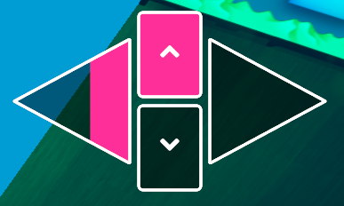
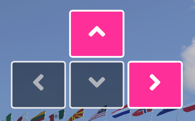
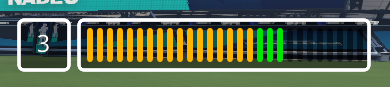
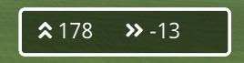
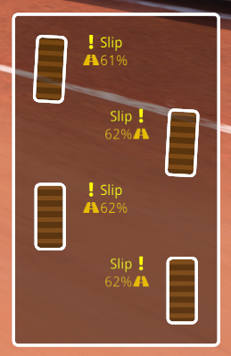

# Dashboard
Plugin for Openplanet that displays a bunch of Trackmania vehicle information on screen. Nice for streaming overlays!

## Features
* Controller visualization
	* Gamepad
	* Keyboard
* Gearbox visualization
* Wheel info visualization
* Speed visualization
* Acceleration visualization
* Clock widget
* Makes use of `VehicleState` (works in solo, online, spectating online, watching replays)
* Fully customizable with many settings
	* Toggle each widget
	* Positions & size
	* Colors & styles

## Installation
You can install the plugin in Openplanet's plugin manager. Additionally, the plugin is available [on Openplanet.dev](https://openplanet.dev/plugin/dashboard) as well.

## Screenshots

